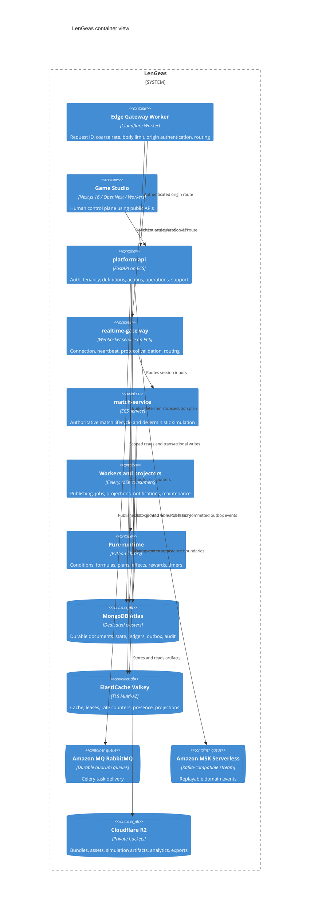

# C4 Container View

The container view preserves the selected Cloudflare/AWS ownership split. Edge services apply policy and route traffic; canonical game and platform rules execute in AWS services; durable authorities remain in MongoDB Atlas and R2.

Services own documented APIs and collections. A service does not import another service's persistence repository.
