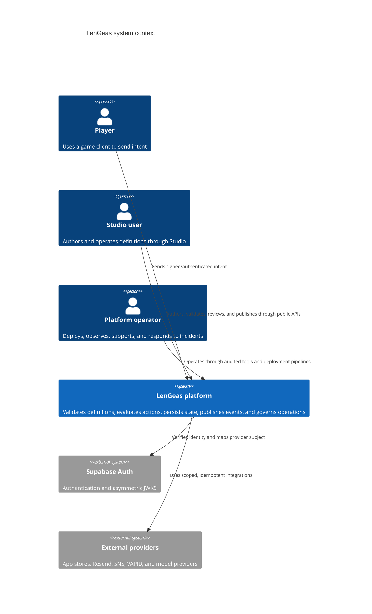

# C4 Context

## Review status

- Phase task: `P00-T03`
- Status: `in_review`
- Source authority: `docs/00-product-charter.md`, `docs/01-principles-and-invariants.md`, `docs/02-system-architecture.md`, `docs/17-security-and-abuse-prevention.md`, `docs/20-infrastructure-and-deployment.md`
- Architecture change: none

LenGeas is a multi-tenant platform for studios, users, players, definitions, runtime actions, operations, simulations, analytics, and governed AI proposals. No client, studio user, or AI agent is trusted to mutate authoritative state directly.

The platform boundary includes Cloudflare edge controls, the AWS application services, durable data services, event/task infrastructure, R2 artifacts, and the public Definition API. Rendering engines, arbitrary user code, and first-party games are outside the boundary.
