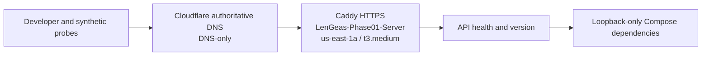

# Current and Target Deployment Views

## Current development deployment

- AWS `us-east-1a`: one `t3.medium` named `LenGeas-Phase01-Server`.
- `games.lengrowth.com`: Cloudflare-authoritative DNS-only record to Caddy on the instance.
- Runtime: digest-pinned Compose dependencies and API health/version shell.
- Data: synthetic development data only.
- Availability: one host and one AZ; no production SLO or DR claim.



## Candidate production regions and environments

- Primary production: AWS `eu-central-1`, three availability zones.
- Disaster recovery: AWS `eu-west-1`.
- Development and testing: shared non-production AWS account.
- Staging and production: separate AWS accounts, projects, clusters, buckets, brokers, keys, and credentials.
- Production data never enters lower environments; sanitized synthetic fixtures are the only supported test data.

This candidate topology is not deployed in Phase 02. ADR-0011 requires a rollout ADR to confirm or supersede the regions and topology using the actual workload before production apply.

```mermaid
C4Deployment
  title LenGeas production deployment
  Deployment_Node(cf, "Cloudflare", "Global edge") {
    Container(edge, "DNS / TLS / WAF / DDoS / Bot / Gateway Workers", "Cloudflare")
    Container(studio, "studio.lengeas.com", "OpenNext on Workers")
    Container(r2, "Private R2 buckets", "R2")
  }
  Deployment_Node(primary, "AWS eu-central-1", "Production account") {
    Deployment_Node(vpc, "VPC", "Three AZs") {
      Container(alb, "Application Load Balancer", "HTTPS from Cloudflare only")
      Container(ecs, "ECS on EC2 capacity providers", "Private subnets; general, simulation, realtime, critical-workers")
      ContainerDb(atlas, "MongoDB Atlas", "PrivateLink")
      ContainerDb(valkey, "ElastiCache Valkey", "TLS, ACL, Multi-AZ")
      ContainerQueue(rabbit, "Amazon MQ RabbitMQ", "Multi-AZ")
      ContainerQueue(msk, "Amazon MSK Serverless", "Private IAM/TLS")
    }
  }
  Deployment_Node(dr, "AWS eu-west-1", "DR account/target") {
    Container(drstack, "Terraform-recreated recovery stack", "Activated only after restore and integrity checks")
  }
  Rel(edge, alb, "Origin-authenticated HTTPS")
  Rel(studio, edge, "Worker route")
  Rel(ecs, atlas, "PrivateLink")
  Rel(ecs, valkey, "Private TLS")
  Rel(ecs, rabbit, "Private TLS")
  Rel(ecs, msk, "Private IAM/TLS")
  Rel(r2, ecs, "Scoped artifact access")
  Rel(dr, drstack, "Terraform and restore procedure")
```

The origin DNS name is not published. ALB ingress accepts Cloudflare traffic and an authenticated rotating origin header. Administrative access uses Cloudflare Access and AWS Systems Manager; SSH and public bastions are forbidden.
