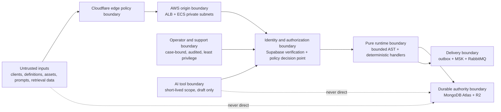

# Trust Boundaries

Boundary rules:

- No public hostname bypasses Cloudflare.
- Edge policy does not execute canonical game rules.
- Origin services accept only authenticated, authorized requests.
- Definitions and prompts are data, never executable authority.
- AI tools can create or patch drafts, validate, simulate, query governed aggregates, and submit for review; they cannot publish, approve, mutate players, read secrets, or access infrastructure.
- Support access is case-bound, redacted, and audited.
- Durable authorities do not accept direct writes from clients, packages, or consumers outside their owning service boundary.
